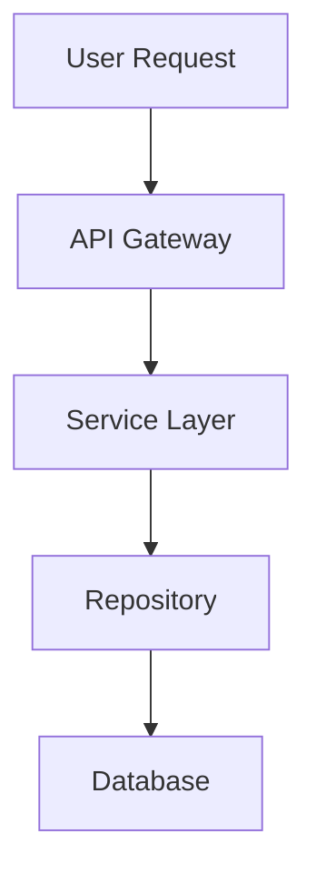

# 📝 Agent Documentation Guidelines

## Philosophie
**Code ohne Dokumentation ist technische Schuld.**  
Agenten müssen nicht nur Code schreiben, sondern auch die Dokumentation aktuell halten.

## Kern-Prinzipien

### 1. Documentation-First für Breaking Changes
Bevor du eine Breaking Change implementierst:
- Erstelle/Aktualisiere die Doku mit dem neuen Verhalten
- Dokumentiere den Migration-Path
- Markiere deprecated Features klar

### 2. Inline-Dokumentation (Code-Level)
```python
# ✅ GOOD: Selbsterklärend mit Docstring
def calculate_tax(amount: Decimal, country_code: str) -> Decimal:
    """
    Calculate tax for a given amount based on country.
    
    Args:
        amount: Net amount in EUR
        country_code: ISO 3166-1 alpha-2 (e.g., "DE", "FR")
    
    Returns:
        Tax amount in EUR
    
    Raises:
        ValueError: If country_code is not supported
    
    Example:
        >>> calculate_tax(Decimal("100.00"), "DE")
        Decimal("19.00")  # 19% MwSt für DE
    """
    tax_rates = {"DE": Decimal("0.19"), "FR": Decimal("0.20")}
    if country_code not in tax_rates:
        raise ValueError(f"Unsupported country: {country_code}")
    return amount * tax_rates[country_code]

# ❌ BAD: Keine Doku
def calc_tax(amt, cc):
    return amt * 0.19
```

### 3. Architecture-Level Dokumentation
Bei strukturellen Änderungen:
- Update `docs/ARCHITECTURE/code_structure.md`
- Füge Diagramme hinzu (Mermaid für Flows)
- Erkläre Entscheidungen (ADR-Style)

### 4. API-Level Dokumentation
Bei neuen Endpoints:
- Update `docs/API/architecture.md`
- Beispiel-Requests/Responses
- Error-Codes dokumentieren
- Rate-Limits angeben

## Dokumentations-Pflicht Checkliste

Nach JEDER Code-Änderung prüfe:

### ✅ Inline-Code (Pflicht)
- [ ] Docstrings für neue/geänderte Functions
- [ ] Type Hints für Parameter und Returns
- [ ] Komplexe Logik hat Code-Comments
- [ ] Magic Numbers durch benannte Constants ersetzt

### ✅ Change-Log (Pflicht)
- [ ] Eintrag in `docs/AGENT_CHANGES.md` erstellt
- [ ] Betroffene Dokumentations-Dateien markiert
- [ ] Impact-Level angegeben

### ✅ Modul-Dokumentation (bei strukturellen Änderungen)
- [ ] `README.md` im Modul-Ordner aktualisiert
- [ ] Abhängigkeiten dokumentiert
- [ ] Setup-Schritte beschrieben

### ✅ API-Dokumentation (bei neuen Endpoints)
- [ ] Request/Response Schema (JSON-Beispiele)
- [ ] Authentifizierung dokumentiert
- [ ] Error-Responses beschrieben

### ✅ Architecture-Dokumentation (bei Design-Änderungen)
- [ ] Design-Entscheidungen erklärt (ADR-Format)
- [ ] Diagramme aktualisiert (Mermaid)
- [ ] Trade-Offs dokumentiert

## Dokumentations-Standards

### Markdown-Stil
```markdown
# Haupt-Titel (nur 1x pro Datei)

## Abschnitt-Titel

### Unter-Abschnitt

- Bullet Point
  - Verschachtelter Punkt

**Fett** für Betonung
*Kursiv* für Begriffe
`Code` für Inline-Code

Absatz mit leerem Zeilenabstand.
```

### Code-Beispiele
````markdown
```python
# Immer Sprache angeben
def example():
    pass
```
````

### Diagramme (Mermaid)
````markdown

````

### API-Dokumentation
```markdown
## POST /api/orders

**Beschreibung:** Erstellt eine neue Bestellung

**Request:**
```json
{
  "customer_id": 123,
  "items": [
    {"product_id": 456, "quantity": 2}
  ]
}
```

**Response (200 OK):**
```json
{
  "order_id": 789,
  "status": "created",
  "total": 99.99
}
```

**Errors:**
- `400 Bad Request`: Invalid customer_id
- `404 Not Found`: Product not found
- `500 Internal Server Error`: Database error
```

## ADR-Format (Architecture Decision Record)

Bei wichtigen Design-Entscheidungen:

```markdown
# ADR-001: Wechsel zu Repository Pattern

**Status:** Accepted  
**Datum:** 2026-02-15  
**Kontext:** Direkte SQL-Queries in Services erschweren Testing und Wartung.

**Entscheidung:** Implementierung des Repository Patterns für alle DB-Zugriffe.

**Konsequenzen:**
- ✅ Verbesserte Testbarkeit (Mock Repositories)
- ✅ Klare Separation of Concerns
- ✅ Einfachere DB-Migration (nur Repository ändern)
- ⚠️ Mehr Boilerplate-Code
- ⚠️ Lernkurve für neue Entwickler

**Alternativen:**
1. Active Record Pattern - verworfen, zu wenig Flexibilität
2. SQLAlchemy ORM - verworfen, zu komplex für unsere Needs
```

## Spezifische Dokumentations-Szenarien

### Szenario 1: Neues Feature
```markdown
1. Erstelle `docs/WORKFLOWS/[feature_name].md`
   - User-Perspektive: Was macht das Feature?
   - Flow-Diagramm (Mermaid)
   - API-Endpoints
   - Konfiguration

2. Update `docs/API/architecture.md`
   - Neue Endpoints hinzufügen
   - Request/Response Schemas

3. Update `docs/ARCHITECTURE/code_structure.md`
   - Neue Module/Services beschreiben
   - Abhängigkeiten aufzeigen

4. Update `README.md`
   - Feature-Liste erweitern
   - Setup-Schritte anpassen (falls nötig)
```

### Szenario 2: Refactoring
```markdown
1. Update Docstrings
   - Geänderte Signaturen dokumentieren
   - Neue Parameter erklären

2. Update `docs/ARCHITECTURE/code_structure.md`
   - Neue Struktur beschreiben
   - Migration-Guide (wenn Breaking)

3. Eintrag in `docs/AGENT_CHANGES.md`
   - Was wurde geändert?
   - Warum wurde geändert?
   - Impact auf andere Module
```

### Szenario 3: Bugfix
```markdown
1. Update `docs/FIXES/[bug_id].md` (optional bei kritischen Bugs)
   - Symptom beschreiben
   - Root Cause Analysis
   - Fix beschreiben
   - Präventions-Maßnahmen

2. Code-Comments bei komplexen Fixes
   - Erkläre WARUM der Fix nötig war
   - Nicht WAS der Code tut (das ist offensichtlich)

3. Tests dokumentieren
   - Regression-Test anlegen
   - Test-Case im Docstring erklären
```

## Dokumentations-Anti-Patterns

### ❌ Veraltete Dokumentation
```markdown
# SCHLECHT: Doku von 2024, Code von 2026
Die API nutzt XML für Responses.  # Wir nutzen JSON seit 2025!
```

### ❌ Redundante Dokumentation
```python
# SCHLECHT: Kommentar wiederholt Code
def add(a, b):
    # Addiert a und b
    return a + b

# BESSER: Kommentar erklärt WARUM/KONTEXT
def calculate_shipping(weight_kg):
    # DHL-Tarif 2026: 5€ Basis + 2€ pro kg
    return 5 + (weight_kg * 2)
```

### ❌ Code ohne Kontext
```python
# SCHLECHT: Magic Number ohne Erklärung
if price > 1000:
    apply_discount()

# BESSER: Konstante mit Kontext
BULK_ORDER_THRESHOLD = 1000  # EUR, ab hier Mengenrabatt
if price > BULK_ORDER_THRESHOLD:
    apply_discount()
```

### ❌ Fehlende Error-Dokumentation
```python
# SCHLECHT: Unklare Exceptions
def process_order(order_id):
    # Can raise various errors...
    pass

# BESSER: Explizite Doku
def process_order(order_id: int) -> Order:
    """
    Process an order.
    
    Raises:
        ValueError: If order_id is invalid
        OrderNotFoundError: If order doesn't exist
        InsufficientStockError: If items unavailable
        PaymentFailedError: If payment processing fails
    """
```

## Integration mit Change-Logging

**Workflow:**
1. Code ändern
2. Inline-Doku aktualisieren (Docstrings, Comments)
3. Change-Log erstellen in `docs/AGENT_CHANGES.md`
4. Betroffene Dokumentations-Dateien markieren (Checkboxen)
5. Dokumentations-Agent verarbeitet später die Checkboxen

**Beispiel aus Change-Log:**
```markdown
**Betroffene Dokumentation:**
- [ ] docs/API/architecture.md - neue POST /api/warehouse/inventory Endpoint
- [ ] docs/ARCHITECTURE/modules.md - Warehouse-Modul beschreiben
- [ ] docs/WORKFLOWS/inventory.md - neu erstellen mit Flow-Diagramm
```

## Werkzeuge & Hilfsmittel

### Mermaid Live Editor
- https://mermaid.live/
- Für Flow-Diagramme

### JSON Schema Generator
- https://www.jsonschema.net/
- Für API-Response Schemas

### Markdown Linting
```bash
# Prüfe Markdown-Syntax
markdownlint docs/**/*.md
```

## Pro-Tipps

1. **Update Doku vor dem Code-Review**  
   Dokumentation ist Teil des Changes, nicht Nacharbeit

2. **README-First Development**  
   Schreibe die README, wie du das Feature nutzen würdest, dann implementiere es

3. **Nutze Code-Beispiele**  
   1 Beispiel > 10 Paragraphen Text

4. **Halte es aktuell**  
   Lieber wenig Doku (aber aktuell) als viel Doku (aber veraltet)

5. **Link statt Duplizieren**  
   Verweise auf andere Docs statt Inhalte zu kopieren

## Zusammenarbeit mit Dokumentations-Agent

Der Dokumentations-Agent:
- Verarbeitet deine Checkboxen aus `AGENT_CHANGES.md`
- Prüft auf Konsistenz zwischen Docs
- Findet veraltete Informationen
- Identifiziert Redundanzen

**Deine Aufgabe:**
- Erstelle Change-Log Einträge mit klaren Checkboxen
- Schreibe inline-Doku (Docstrings, Comments)
- Markiere Breaking Changes deutlich

**Aufgabe des Doku-Agents:**
- Aktualisiert zentrale Dokumentations-Dateien
- Prüft Cross-References
- Archiviert alte Change-Logs
